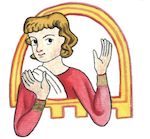

## Historische Narratologie

Das folgende Comic "" ist dazu gedacht, Interessierten historische Narratologie näherzubringen. Zum Selbststudium, für den schulischen oder universitären Unterricht, Tagungs-Workshops, etc.!

|:-:|:-:|
|
Herzlich,    
Eva-Lotte Gebhardt (bald Dr. der Germanistik)    
eva-lotte.gebhardt@protonmail.com

||

[Titel](page1.html)  
(Wenn man über die blauen Punkte hovert, erscheinen Erklärungen)

Diese Open Educational Resource ist unter der Creative Commons Attribution 4.0 International lizensiert, und darf für beliebige Zwecke geteilt, vervielfältigt und weiterverarbeitet werden. Kommerzielle Nutzung ist ebenfalls erlaubt. Bei jeder Veröffentlichung muss die Urheberin genannt werden, ebenso wie die Lizenz und vorgenommene Änderungen. Das Material darf nur unter der gleichen Lizenz wie das Original verbreitet werden. 

PS: Hier [mehr Kunst](https://www.pixiv.net/en/users/111957776) und hier [mehr Mediävistisches](https://rebpaf.wordpress.com/2025/02/13/a-romeo-and-juliet-bible-fragmen-story)

	[English](en.md)
