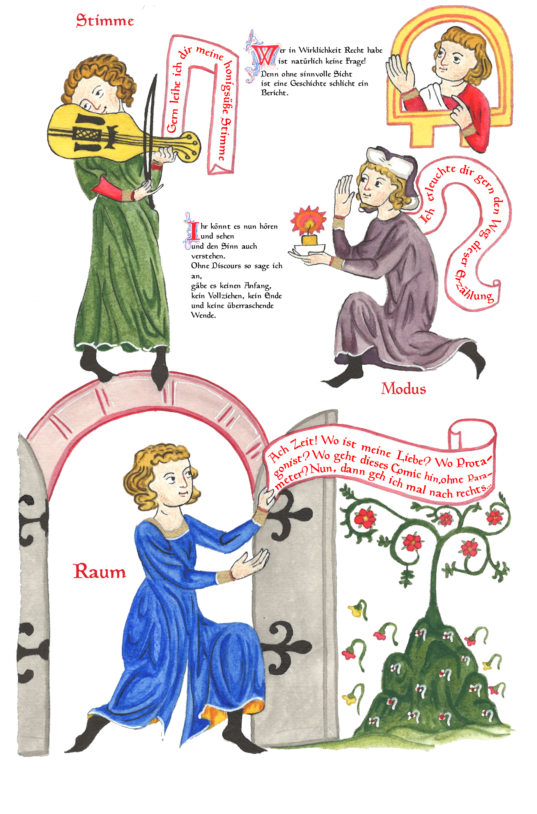

  
  
  <!-- Marker 1 -->
  

    Part A details
  

  
  <!-- Marker 2 -->
  

    Part B details
  

.image-container {
  position: relative;
  display: inline-block;
}

.marker {
  position: absolute;
  width: 16px;
  height: 16px;
  background-color: #6d4aff;
  border: 2px solid white;
  border-radius: 50%;
  cursor: pointer;
}

/* Position markers using percentages (adjust as needed) */
.marker:nth-child(1) { top: 25%; left: 30%; }
.marker:nth-child(2) { top: 70%; left: 65%; }

/* Tooltip styling */
.tooltip-text {
  visibility: hidden;
  position: absolute;
  bottom: 130%;
  left: 50%;
  transform: translateX(-50%);
  background-color: #333;
  color: white;
  padding: 8px 12px;
  border-radius: 6px;
  white-space: nowrap;
  font-size: 14px;
  z-index: 10;
  opacity: 0;
  transition: opacity 0.2s;
  pointer-events: none;
}

/* Show tooltip on hover */
.marker:hover .tooltip-text {
  visibility: visible;
  opacity: 1;
}

/* Optional: pulsing effect on markers */
@keyframes pulse {
  0% { box-shadow: 0 0 0 0 rgba(109, 76, 255, 0.7); }
  70% { box-shadow: 0 0 0 10px rgba(109, 76, 255, 0); }
  100% { box-shadow: 0 0 0 0 rgba(109, 76, 255, 0); }
}

.marker {
  animation: pulse 2s infinite;
}

## [1](index.md) ❧ ☞ 2 ❧ [3](page3.md) ❧ [4](page4.md) ❧ [5](page5.md) ❧ [6](page6.md) ❧ [7](page7.md) ❧ [8](page8.md) ❧ [9](page9.md)
